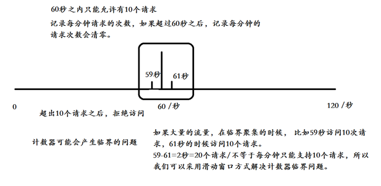
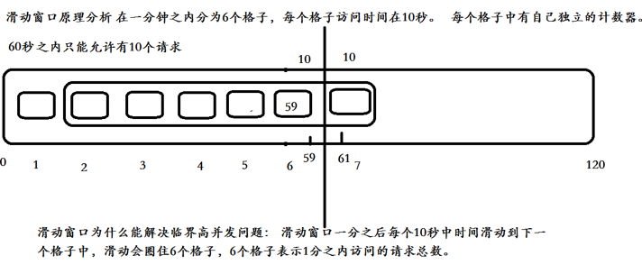
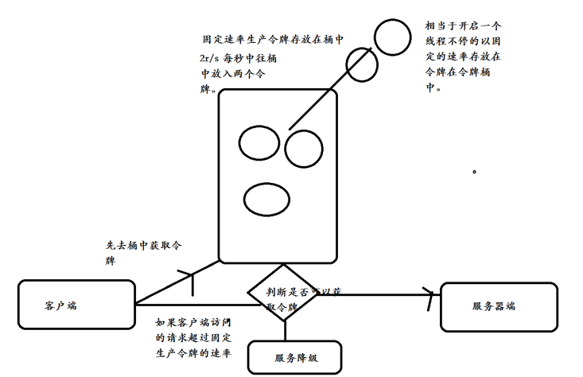
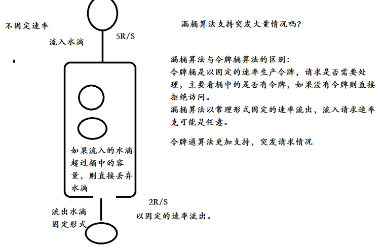

## 义码当仙之高并发与高可用实战（Nginx篇）

### DNS域名解析  
整个过程大体描述如下，其中前2个步骤是在本机完成的，后8个步骤涉及到真正的域名解析服务器：  
1. 浏览器会检查缓存中有没有这个域名对应的解析过的IP地址，如果缓存中有，这个解析过程就结束。
浏览器缓存域名也是有限制的，不仅浏览器缓存大小有限制，而且缓存的时间也有限制，通常情况下为几分钟到几小时不等，域名被缓存的时间限制可以通过TTL属性来设置。
这个缓存时间太长和太短都不太好，如果时间太长，一旦域名被解析到的IP有变化，会导致被客户端缓存的域名无法解析到变化后的IP地址，以致该域名不能正常解析，这段时间内有一部分用户无法访问网站。
如果设置时间太短，会导致用户每次访问网站都要重新解析一次域名。  
2. 如果用户浏览器缓存中没有数据，浏览器会查找操作系统缓存中是否有这个域名对应的DNS解析结果。其实操作系统也有一个域名解析的过程，
在Windows中可以通过C:\Windows\System32\drivers\etc\hosts文件来设置，在Linux中可以通过/etc/hosts文件来设置，用户可以将任何域名解析到任何能够访问的IP地址。
例如，我们在测试时可以将一个域名解析到一台测试服务器上，这样不用修改任何代码就能测试到单独服务器上的代码的业务逻辑是否正确。
正是因为有这种本地DNS解析的规程，所以有黑客就可能通过修改用户的域名来把特定的域名解析到他指定的IP地址上，导致这些域名被劫持。  
3. 前两个过程无法解析时，就要用到我们网络配置中的"DNS服务器地址"了。操作系统会把这个域名发送给这个LDNS，也就是本地区的域名服务器。
这个DNS通常都提供给用户本地互联网接入的一个DNS解析服务，例如用户是在学校接入互联网，那么用户的DNS服务器肯定在学校；
如果用户是在小区接入互联网，那么用户的DNS就是再提供接入互联网的应用提供商，即电信或联通，也就是通常说的SPA，那么这个DNS通常也会在用户所在城市的某个角落，不会很远。
Windows环境下通过命令行输入ipconfig，Linux环境下通过cat /etc/resolv.conf就可以查询配置的DNS服务器了。
这个专门的域名解析服务器性能都会很好，它们一般都会缓存域名解析结果，当然缓存时间是受到域名的失效时间控制的。大约80%的域名解析到这里就结束了，所以LDNS主要承担了域名的解析工作。  
4. 如果LDNS仍然没有命中，就直接到Root Server域名服务器请求解析  
5. 根域名服务器返回给本地域名服务器一个所查询的主域名服务器（gTLD Server）地址。gTLD是国际顶级域名服务器，如.com、.cn、.org等，全球只有13台左右  
6. 本地域名服务器LDNS再向上一步返回的gTLD服务器发送请求  
7. 接受请求的gTLD服务器查找并返回此域名对应的Name Server域名服务器的地址，这个Name Server通常就是用户注册的域名服务器，例如用户在某个域名服务提供商申请的域名，那么这个域名解析任务就由这个域名提供商的服务器来完成  
8. Name Server域名服务器会查询存储的域名和IP的映射关系表，在正常情况下都根据域名得到目标IP地址，连同一个TTL值返回给DNS Server域名服务器  
9. 返回该域名对应的IP和TTL值，LDNS会缓存这个域名和IP的对应关系，缓存时间由TTL值控制  
10. 把解析的结果返回给用户，用户根据TTL值缓存在本地系统缓存中，域名解析过程结束  
在实际的DNS解析过程中，可能还不止这10步，如Name Server可能有很多级，或者有一个GTM来负载均衡控制，这都有可能会影响域名解析过程。  

---

## 高并发与高可用
### 大型网站系统应有的特点  
#### 高并发，大流量  
需要面对高并发用户，大流量访问。举个例子，去往迪拜的飞机有200张票，但是有100w人都挤进系统买票，如何让这100w人能够看到票务的实时更新，以及顺利的买到一张票，都是一个网站架构师应该考虑的问题。
这也许对于淘宝的“双十一”1000w的一分钟独立访问用户量来说，是个微不足道的数字，但是对于用户的体验以及网站的口碑来说，都是一项不小的挑战。  
#### 高可用  
相对于高并发来说，高可用并不是一个比较有规律的参数，7*24 是每个网站的梦想，但是你并不知道，在某一刻，它就没理由的宕机了。  
#### 海量数据  
存储、管理海量的数据，需要使用大量的服务器。FaceBook每周上传的照片接近10亿，没有一个大型的存储服务器的支撑，相信用户量不会一直飙升。  
#### 用户分布广泛，网络情况复杂  
许多大型的互联网都是为全球用户提供服务的，用户分布范围广，各地网络情况千差万别。各个运行商之间的互通，各个国家的数据连接等等。  
#### 安全环境恶劣  
由于互联网的开放性，使得互联网更容易受到攻击，包括各种身份证信息被窃取等事件屡见不鲜。  
#### 渐进式发展
几乎所有的大型互联网网站都是从一个小网站开始，渐进发展起来的，好的互联网产品都是慢慢运营出来的。  

### 网站架构演变过程  
#### 传统架构  
传统项目分为三层架构，将业务逻辑层、数据库访问层、控制层放入在一个项目中 使用SSH或者SSM技术。  
优点:适合于个人或者小团队开发，不适合大团队开发。  
#### 分布式架构  
根据业务需求进行拆分成N个子系统，多个子系统相互协作才能完成业务流程子系统之间通讯使用RPC远程通讯技术。  
优点:  
1. 把模块拆分，使用接口通信，降低模块之间的耦合度。  
2. 把项目拆分成若干个子项目，不同的团队负责不同的子项目。  
3. 增加功能时只需要再增加一个子项目，调用其它系统的接口就可以。  
4. 可以灵活的进行分布式部署。  
有优点就有缺点，缺点如下：  
1. 系统之间交互需要使用远程通信，接口开发增加工作量。  
2. 各个模块有一些通用的业务逻辑无法共用。  
为了解决上面分布式架构的缺点，我们引入了soa架构，SOA：Service Oriented Architecture面向服务的架构。也就是把工程拆分成服务层、表现层两个工程。
服务层中包含业务逻辑，只需要对外提供服务即可。表现层只需要处理和页面的交互，业务逻辑都是调用服务层的服务来实现。  
#### SOA架构  
SOA是一种软件架构模式，将共同的业务逻辑抽取出来，封装成单独的服务。业务系统分解为多个组件，让每个组件都独立提供离散，自治，可复用的服务能力。通过服务的组合和编排来实现上层的业务流程。  
作用：简化维护，降低整体风险，伸缩灵活  
#### 微服务架构  
微服务是指开发一个单个、小型的但有业务的服务，每个服务都有自己的处理和轻通讯机制，可以部署在单个服务器上，让专业的人做专业的事情。微服务与SOA相比，更加轻量级。  
#### SOA与微服务架构区别  
SOA架构主要针对企业级、采用ESB服务（ESB企业服务总线），非常重，需要序列化和反序列化，采用XML格式传输。  
微服务架构主要互联网公司，轻量级、小巧，独立运行，基于Http+Rest+JSON格式传输。  
ESB也可以说是传统中间件技术与XML、Web服务等技术相互结合的产物。  

1. 在微服务中，与SOA不同，服务可以独立于其他服务进行操作和部署，因此更容易经常部署新版本的服务和独立扩张服务，让专业的人做专业的事情，快速迭代新的产品。  
2. 在SOA中服务可能共享数据存储，而微服务中每个服务都具有独立的数据存储。  
3. SOA与微服务主要区别在于规模和范围，SOA是一种思想，是面向服务架构体系，微服务继承 了SOA的优点，去除传统的ESB消息总线，采用Http+json格式通讯方式，更加轻量级。  

### 高并发设计原则  
系统设计不仅需要考虑实现业务功能，还要保证系统高并发、高可用、高可靠等。同时还应考虑系统容量规划（流量、容量等）、
SLA指定（吞吐量、响应时间、可用性、降级方案等）、监控报警（机器负载、响应时间、可用率等）、应急预案（容灾、降级、限流、隔离、切流量、可回滚等）。  
- 缓存  
- 异步并发  
- 连接池  
- 线程池  
- 扩容  
- 消息队列  
- 分布式任务  
#### 拆分系统  
在我们从零开始做一个新系统的时候，会首先进行系统功能模块架构设计，那么是直接做一个大而全的垂直的MVC系统，使用一个war包进行发布管理，还是需要按一些规则进行模块拆分，设计成SOA或者微服务系统比较好呢？
这个需要依据项目具有什么样的人力物力条件以及项目需要支撑多少用户量和交易量为基础。一个好的系统设计应该能够满足解决当前的需求和问题，把控实现和进度风险，预测和规划未来，避免过度设计，在上线一个基础核心版本之后，再进行不断迭代和完善。  

进行SOA、微服务系统架构设计时模块拆分的一些维度和原则：  
1. 系统维度：按照系统功能、业务拆分，如、优惠券、购物车，结算，订单等系统。  
2. 功能维度：对系统功能在做细粒度拆分，优惠券系统分为 优惠券后台系统、领券系统、发券系统。  
3. 读写维度：比如商品系统中，如果查询量比较大，可以单独分为两个服务，分别为查询服务和写服务，读写比例特征拆分；读多，可考虑多级缓存；写多，可考虑分库分表。  
4. AOP维度： 根据访问特征，按照 AOP 进行拆分，比如商品详情页可分为 CDN、页面渲染系统，CDN 就是一个 AOP 系统  
5. 模块维度：对整体代码结构划分 Web、Service、DAO  
#### 服务化  
在分布式系统中，将业务逻辑层封装成接口形式，暴露给其他系统调用，那么这个接口我们可以理解为叫做服务。当服务越来越多的时候，就会需要用到服务治理，那么会用到Dubbo、SpringCloud服务治理框架。  

服务化演进: 进程内服务-单机远程服务-集群手动注册服务-自动注册和发现服务-服务的分组、隔离、路由-服务治理。  
考虑服务分组、隔离、限流、黑白名单、超时、重试机制、路由、故障补偿等。  
实践：利用 Nginx、HaProxy、LVS 等实现负载均衡，ZooKeeper、Consul 等实现自动注册和发现服务。  
#### 消息队列  
消息中间件是一个客户端与服务器异步通讯框架，消息中间件中分为点对点与发布订阅通讯方式，生产者发送消息后，消费者可以无需等待，异步接受生产者发送消息。  
在电商系统中，会使用消息队列异步推送消息，注意消息失败重试幂等性问题。  
幂等性问题解决方案，使用持久化日志+全局id记录。  
#### 缓存技术
- 浏览器端缓存  
- APP客户端缓存  
- CDN(Content Delivery Network)缓存  
- 接入层缓存  
- 应用层缓存  
- 分布式缓存  

对于兜底数据或者异常数据，不应该让其缓存，否则用户会在很长一段时间里看到这些数据。  
#### 并发化
改串行为并行。  

### 高可用设计原则  
1. 通过负载均衡和反向代理实现分流。  
2. 通过限流保护服务免受雪崩之灾。  
3. 通过降级实现部分可用、有损服务。  
4. 通过隔离实现故障隔离。  
5. 通过合理设置的超时与重试机制避免请求堆积造成雪崩。  
6. 通过回滚机制快速修复错误版本。  

#### 降级
对于高可用服务，很重要的一个设计就是降级开关，在设计降级开关时，主要依据如下思路：  
1. 开关集中化管理：通过推送机制把开关推送到各个应用。  
2. 可降级的多级读服务：比如服务调用降级为只读本地缓存、只读分布式缓存、只读默认降级数据（如库存状态默认有货）。  
3. 开关前置化：如架构是Nginx–>tomcat，可以将开关前置到Nginx接入层，在Nginx层做开关，请求流量回源后端应用或者只是一小部分流量回源。  
4. 业务降级：当高并发流量来袭，在电商系统大促设计时保障用户能下单、能支付是核心要求，并保障数据最终一致性即可。这样就可以把一些同步调用改成异步调用，优先处理高优先级数据或特殊特征的数据，合理分配进入系统的流量，以保障系统可用。  

#### 限流
目的: 防止恶意请求攻击或超出系统峰值  
实践：  
恶意请求流量只访问到 Cache  
穿透后端应用的流量使用 Nginx 的 limit 处理  
恶意 IP 使用 Nginx Deny 策略或者 iptables 拒绝  

#### 切流量
目的：屏蔽故障机器  
实践:  
DNS: 更改域名解析入口，如 DNSPOD 可以添加备用 IP，正常 IP 故障时，会自主切换到备用地址; 生效实践较慢  
HttpDNS: 为了绕过运营商 LocalDNS 实现的精准流量调度  
LVS/HaProxy/Nginx: 摘除故障节点  

#### 可回滚
发布版本失败时可随时快速回退到上一个稳定版本  

### 业务设计原则  
#### 防重设计  
页面请求防止重复提交，可以采用防重key、放重表、Token等  
采用图形验证，防止机器攻击。  
#### 幂等设计  
消息中间件：消息中间件中应该注意因网络延迟的原因，导致消息重复消费。  
第三方支付接口：在回调接口中，应该注意网络延迟，没有及时返回给第三方支付平台，注意回调幂等性问题。  
分布式系统中，保证生成的订单号唯一性，定时Job执行的幂等性问题等。  
#### 流程定义  
复用流程系统，提供个性化的流程服务。  
#### 状态与状态机
复用流程系统，提供个性化的流程服务。  
#### 后台系统操作可反馈  
设计后台系统时，考虑效果的可预览、可反馈。  
#### 后台系统审批化  
对于有些重要的后台功能需要设计审批流，比如调整价格，并对操作进行日志记录，从而保证操作可追溯、可审计。  
#### 文档注释  
系统发展的最初阶段就应该有文档库（设计架构、设计思想、数据字典/业务流程、现有问题），业务代码合特殊需求都要有注释。  
#### 备份  
包括代码和人员的备份。代码主要提交到代码仓库进行管理和备份，代码仓库至少应该具备多版本的功能。人员备份指的是一个系统至少应该有两名开发人员是了解的。  

--- 

### 环境与工具准备  

#### 环境
CentOS 7.0 64位以上 + 一台外网服务器 + 一个域名 + CDN内容分发，电脑配置16g以上内存  

CentOS7 关闭防火墙  
```
# 临时关闭
systemctl stop firewalld
# 禁止开机启动
systemctl disable firewalld

removed symlink /etc/systemd/system/multi-user.target.wants/firewalld.service
removed symlink /etc/systemd/system/dbus-org.fedoraproject.FirewallD1.service
```

#### 外网映射工具  
在做微信开发或者是对接第三方支付接口时，回调接口可能需要外网访问。  
这时候开发者在本地测试的时候，需要用到外网测试工具。  
常用的外网测试工具有natapp、ngrok  

- NatApp，[官网地址](https://natapp.cn)  
[使用教程](https://natapp.cn/article/nohup)  

```
cd /usr/local/natapp
chmod a+x natapp

./natapp -authtoken=xxxx
```

--- 

### Nginx   

Nginx是一款轻量级的Web服务器/反向代理服务器及电子邮件(IMAP/POP3)代理服务器，并在一个BSD-like协议下发行。
由俄罗斯的程序设计师Igor Sysoev所开发，供俄国大型的入口网站及搜索引擎Rambler(俄文：Рамблер)使用。
其特点是占有内存少，并发能力强，事实上nginx的并发能力确实在同类型的网页服务器中表现较好.中国大陆使用nginx网站用户有：新浪、网易、 腾讯等。  
Nginx是一个高性能的Web和反向代理服务器, 它具有有很多非常优越的特性:  
作为Web服务器：相比 Apache，Nginx 使用更少的资源，支持更多的并发连接，体现更高的效率，这点使Nginx尤其受到虚拟主机提供商的欢迎。能够支持高达 50,000 个并发连接数的响应，感谢 Nginx 为我们选择了 epoll and kqueue 作为开发模型。  
作为负载均衡服务器：Nginx 既可以在内部直接支持 Rails 和 PHP，也可以支持作为 HTTP代理服务器 对外进行服务。Nginx 用 C 编写, 不论是系统资源开销还是 CPU 使用效率都比 Perlbal 要好的多。  
作为邮件代理服务器: Nginx 同时也是一个非常优秀的邮件代理服务器（最早开发这个产品的目的之一也是作为邮件代理服务器），Last.fm 描述了成功并且美妙的使用经验。  

Nginx 安装非常的简单，配置文件 非常简洁（还能够支持perl语法），Bugs非常少的服务器: Nginx 启动特别容易，并且几乎可以做到7*24不间断运行，即使运行数个月也不需要重新启动。你还能够在不间断服务的情况下进行软件版本的升级。  
Nginx一般用户七层负载均衡，其吞吐量有一定的限制。为了提高整体的吞吐量，会在DNS和Nginx之间引入LVS（软件负载均衡器）、F5（硬负载均衡器）可以做四层负载均衡，首先DNS解析到LVS(F5)，然后LVS(F5)转发给Nginx，再由Nginx转发给真实的服务器  

#### Nginx安装  
[Nginx下载地址](http://nginx.org/download/)  
[PCRE下载地址](http://jaist.dl.sourceforge.net/project/pcre/pcre/)  
[安装Nginx](https://github.com/ymdx0610/ymdx-software-installation/wiki/Centos7下安装Nginx)  

#### Nginx应用场景
1. http服务器：Nginx是一个http服务可以独立提供http服务。可以做网页静态服务器。  
2. 虚拟主机：可以实现在一台服务器虚拟出多个网站，例如个人网站使用的虚拟机。  
3. 反向代理，负载均衡：当网站的访问量达到一定程度后，单台服务器不能满足用户的请求时，需要用多台服务器集群可以使用nginx做反向代理。并且多台服务器可以平均分担负载，不会应为某台服务器负载高宕机而某台服务器闲置的情况。  
4. Nginx中也可以配置安全管理、比如可以使用Nginx搭建API接口网关，对每个接口服务进行拦截。  

#### Nginx目录结构
``` 
[root@localhost download]# ls nginx-1.9.9
auto  CHANGES  CHANGES.ru  conf  configure  contrib  html  LICENSE  Makefile  man  objs  README  src
```
- src目录：存放Nginx源码  
- man目录：存放Nginx帮助手册  
- html目录：存放默认网站文件  
- contrib目录：存放其他机构或组织贡献的代码  
- conf目录：存放Nginx服务器的配置文件  
- auto目录：存放大量的脚本文件，和configure脚本程序相关  
- configure文件：Nginx自动安装脚本，用于检查环境，生成编译代码需要的makefile文件  
- CHANGES、CHANGES.ru、LICENSE和README都是Nginx服务器的相关文档资料。  

安装后：  
```
Nginx_
|_  xx_temp  临时文件目录
|_  conf     配置目录
|_  html     静态页面目录
|_  logs     日志目录
|_  sbin     主程序目录
```

#### Nginx静态资源
静态资源访问存放在nginx的html目录  

#### Nginx配置虚拟主机
1. 基于域名的虚拟主机，通过域名来区分虚拟主机——应用：外部网站  
2. 基于端口的虚拟主机，通过端口来区分虚拟主机——应用：公司内部网站，外部网站的管理后台  
3. 基于IP的虚拟主机，几乎不用。  

- 基于域名的虚拟主机  
实战目标：  
1. 浏览器访问www.ymdx.com，将访问nginx/data/www下资源文件  
2. 浏览器访问bbs.ymdx.com，将访问nginx/data/bbs下资源文件  
```
# 本机修改hosts文件，添加如下配置，其中172.16.49.131为装有nginx的虚拟主机IP地址
172.16.49.131 www.ymdx.com
172.16.49.131 bbs.ymdx.com

# 在172.16.49.131虚机上做如下操作

$ cd /opt/app/nginx/
# 创建目录
$ mkdir -p data/www data/bbs


$ cd html/
$ cp * ../data/www/
$ cp * ../data/bbs/

# 分别进入../data/www/和../data/bbs/目录，编辑index文件做展示区分
$ vim ../data/www/index.html  # Welcome to Ymdx-www!
$ vim ../data/bbs/index.html  # Welcome to Ymdx-bbs!

# 修改配置文件
$ vim conf/nginx.conf

# 配置如下：
server{
    listen 80;
    server_name www.ymdx.com;

    location / {
       root data/www;
       index index.html index.htm;
    }

    error_page   500 502 503 504  /50x.html;
    location = /50x.html {
       root root/www;
    }
}
server{
    listen 80;
    server_name bbs.ymdx.com;

    location / {
       root data/bbs;
       index index.html index.htm;
    }

    error_page   500 502 503 504  /50x.html;
    location = /50x.html {
       root data/bbs;
    }
}

# 验证配置是否正确
$ /opt/app/nginx/sbin/nginx -t

# 启动nginx
$ /opt/app/nginx/sbin/nginx

# 浏览器查看效果
http://www.ymdx.com/
http://bbs.ymdx.com/
```

- 基于端口的虚拟主机  
实战目标：  
1. 浏览器访问www.ymdx.com:8080，将访问nginx/data/www下资源文件  
2. 浏览器访问www.ymdx.com:8081，将访问nginx/data/bbs下资源文件  
```
# 配置如下：
server{
    listen 8080;
    server_name www.ymdx.com;

    location / {
       root data/www;
       index index.html index.htm;
    }

    error_page   500 502 503 504  /50x.html;
    location = /50x.html {
       root root/www;
    }
}
server{
    listen 8081;
    server_name www.ymdx.com;

    location / {
       root data/bbs;
       index index.html index.htm;
    }

    error_page   500 502 503 504  /50x.html;
    location = /50x.html {
       root data/bbs;
    }
}

# 验证配置是否正确
$ /opt/app/nginx/sbin/nginx -t

# 重新载入配置文件
/opt/app/nginx/sbin/nginx -s reload

# 开发端口号
$ firewall-cmd --permanent --zone=public --add-port=8080/tcp
$ firewall-cmd --permanent --zone=public --add-port=8081/tcp
$ firewall-cmd --reload

# 浏览器查看效果
http://www.ymdx.com:8080/
http://www.ymdx.com:8081/
```

#### Nginx配置反向代理
反向代理（Reverse Proxy）方式是指以代理服务器来接受internet上的连接请求，然后将请求转发给内部网络上的服务器，
并将从服务器上得到的结果返回给internet上请求连接的客户端，此时代理服务器对外就表现为一个反向代理服务器。  

- 反向代理的好处  
反向代理的好处隐藏真实内部ip地址，请求先访问nginx代理服务器（外网可以访问到）,在使用nginx服务器转发到真实服务器中。  

实战步骤与目标：  
本地192.168.1.101启动两个SpringBoot应用，端口分别为8080和8081
1. 浏览器访问www.ymdx.com，nginx接收请求并将其转发至192.168.1.101:8080  
2. 浏览器访问bbs.ymdx.com，nginx接收请求并将其转发至192.168.1.101:8081  

```
# 配置如下：
server{
    listen 80;
    server_name www.ymdx.com;

    location / {
       proxy_pass http://192.168.1.101:8080;
       index index.html index.htm;
    }

    error_page   500 502 503 504  /50x.html;
    location = /50x.html {
       root root/www;
    }
}
server{
    listen 80;
    server_name bbs.ymdx.com;

    location / {
       proxy_pass http://192.168.1.101:8081;
       index index.html index.htm;
    }

    error_page   500 502 503 504  /50x.html;
    location = /50x.html {
       root data/bbs;
    }
}

# 验证配置是否正确
$ /opt/app/nginx/sbin/nginx -t

# 重新载入配置文件
/opt/app/nginx/sbin/nginx -s reload

# 浏览器查看效果
http://www.ymdx.com/
http://bbs.ymdx.com/
```

#### Location正则表达式  
- location的作用  
根据用户请求的URI来执行不同的应用，也就是根据用户请求的网站URL进行匹配，匹配成功即进行相关的操作。  

- location的语法  

|||
|:----|:----|
|=|表示精确匹配|  
|^~|表示uri以某个常规字符串开头，不是正则匹配| 
|~|表示区分大小写的正则匹配| 
|~*|表示不区分大小写的正则匹配|
|/|通用匹配, 如果没有其它匹配，任何请求都会匹配到|

- location正则案例  
```
server{
    listen 80;
    server_name www.ymdx.com;

    # 匹配所有以/开头的请求
    location / {
       root html;
       index index.html index.htm;
    }
}
```
```
server{
    listen 80;
    server_name www.ymdx.com;

    # 精确匹配，/后面不能带任何字符
    location =/ {
       root html;
       index index.html index.htm;
    }
}
```
nginx location配置，默认开启不区分大小写  
实战目标：根据域名相同，项目名不同，跳转到不同的真实的服务器  
```
server{
    listen 80;
    server_name www.ymdx.com;

    # 匹配以/ymdx_8080开头的请求，反向代理至192.168.1.101:8080
    location /ymdx_8080/ {
       proxy_pass http://192.168.1.101:8080/;
       index index.html index.htm;
    }
    
    # 匹配以/ymdx_8081开头的请求，反向代理至192.168.1.101:8080
    location /ymdx_8081/ {
       proxy_pass http://192.168.1.101:8081/;
       index index.html index.htm;
    }
}
```

#### 负载均衡  

-  负载均衡作用  
建立在现有网络结构之上，它提供了一种廉价有效透明的方法扩展网络设备和服务器的带宽、增加吞吐量、加强网络数据处理能力、提高网络的灵活性和可用性。  
负载均衡，英文名称为Load Balance，其意思就是分摊到多个操作单元上进行执行，例如Web服务器、FTP服务器、企业关键应用服务器和其它关键任务服务器等，从而共同完成工作任务。  
负载均衡就是将所有请求先到负载均衡器，在由负载均衡器采用负载均衡算法（轮询、IP绑定、权重）分发到不同实际的服务器中，这也就是服务器集群，集群的目的是为了减轻单台服务器压力。  

- 负载均衡的缺点  
使用负载均衡后，实际用到的服务器会被集群多台，那么这时候就会产生很多分布式相关问题。  
比如：  
分布式Session一致性问题；  
分布式定时任务调度幂等性问题；  
分布式生成全局订单ID；  
分布式锁；  
分布式配置中心；  
分布式日志收集；  

- 网络模型图  

|OSI中的层|功能|TCP/IP协议族|
|:----|:----|:----|
|应用层|文件传输，电子邮件，文件服务，虚拟终端|TFTP,HTTP,SNMP,FTP,SMTP,DNS,RIP,Telnet|
|表示层|数据格式化，代码转换，数据加密|没有协议|
|会话层|解除或建立与别的接点的联系|没有协议|
|传输层|提供端对端的接口|TCP,UDP|
|网络层|为数据包选择路由|IP,ICMP,OSPF,BGP,IGMP,ARP,RARP|
|数据链路层|传输有地址的桢以及错误检测功能|SLIP,CSLIP,PPP,MTU,ARP,RARP|
|物理层|以二进制数据形式在物理媒体上传输数据|ISO2110,IEEE802,IEEE802.2|

  

- 四层和七层负载均衡的区别  
四层负载均衡，在网络模型中的传输层中，基于主要是基于tcp协议报文实现负载均衡（比如LVS、haproxy就是四层负载均衡器），使用改写报文的源地址和目的地址。  
七层负载均衡，在网络模型中应用层中，基于URL或者HTTP协议实现负载均衡，Web服务器。  

- Upstream Server 负载均衡  
Upstream Server 中文翻译为上游服务器，意思就是负载均衡服务器设置，白话文表示就是被nginx代理最后真实访问的服务器。  
负载均衡算法：配置多个上游服务器（真实业务逻辑访问的服务器）的负载均衡机制  
失败重试机制：当上游服务器（真实业务逻辑访问的服务器）出现超时或者服务器不存活，是否考虑重试机制（补偿机制）  
服务器心跳检测: 当上游服务器（真实业务逻辑访问的服务器），监控检测|心跳检测  

- Nginx配置负载均衡  
Nginx负载均衡提供上游服务器（真实业务逻辑访问的服务器），负载均衡、故障转移、失败重试、容错、健康检查等。  
当上游服务器（真实业务逻辑访问的服务器）发生故障时，可以转移到其他上游服务器（真实业务逻辑访问的服务器）。  

- 负载均衡算法  
1、轮询（默认）  
每个请求按时间顺序逐一分配到不同的后端服务，如果后端某台服务器死机，自动剔除故障系统，使用户访问不受影响。  
2、weight（轮询权值）  
weight的值越大分配到的访问概率越高，主要用于后端每台服务器性能不均衡的情况下。或者仅仅为在主从的情况下设置不同的权值，达到合理有效的地利用主机资源。  
3、ip_hash  
每个请求按访问IP的哈希结果分配，使来自同一个IP的访客固定访问一台后端服务器，并且可以有效解决动态网页存在的session共享问题。俗称IP绑定。  
4、fair（第三方）  
比 weight、ip_hash 更加智能的负载均衡算法，fair算法可以根据页面大小和加载时间长短智能地进行负载均衡，也就是根据后端服务器的响应时间来分配请求，响应时间短的优先分配。
Nginx本身不支持fair，如果需要这种调度算法，则必须安装upstream_fair模块。  
5、url_hash（第三方）  
按访问的URL的哈希结果来分配请求，使每个URL定向到一台后端服务器，可以进一步提高后端缓存服务器的效率。Nginx本身不支持url_hash，如果需要这种调度算法，则必须安装Nginx的hash软件包。  

- 负载均衡实战 

实战1：浏览器访问www.ymdx.com，nginx接收请求并将其转发至192.168.1.101:8080、192.168.1.101:8081（默认轮询策略）  
```
upstream ymdxServer {
    server 192.168.1.101:8080;
    server 192.168.1.101:8081;
}
server{
    listen 80;
    server_name www.ymdx.com;

    location / {
       proxy_pass http://ymdxServer/;
       index index.html index.htm;
    }
}
```
实战2：采用权重策略  
```
upstream ymdxServer {
    server 192.168.1.101:8080 weight=1;
    server 192.168.1.101:8081 weight=2;
}
server{
    listen 80;
    server_name www.ymdx.com;

    location / {
       proxy_pass http://ymdxServer/;
       index index.html index.htm;
    }
}
```
实战3：采用IP绑定策略  
```
upstream ymdxServer {
    server 192.168.1.101:8080;
    server 192.168.1.101:8081;
    ip_hash;
}
server{
    listen 80;
    server_name www.ymdx.com;

    location / {
       proxy_pass http://ymdxServer/;
       index index.html index.htm;
    }
}
```

- Nginx配置故障转移  
当上游服务器（真实访问的服务器），一旦出现故障或者是没有及时响应，应该直接轮询到下一台服务器，保证服务器的高可用。  

proxy_connect_timeout：后端服务器连接的超时时间_发起握手等候响应超时时间  
proxy_read_timeout：连接成功后_等候后端服务器响应时间_其实已经进入后端的排队之中等候处理（也可以说是后端服务器处理请求的时间）  
proxy_send_timeout：后端服务器数据回传时间_就是在规定时间之内后端服务器必须传完所有的数据  

``` 
upstream ymdxServer {
    server 192.168.1.101:8080;
    server 192.168.1.101:8081;
}
server{
    listen 80;
    server_name www.ymdx.com;

    location / {
       proxy_pass http://ymdxServer/;
       proxy_connect_timeout 1s;
       proxy_read_timeout 1s;
       proxy_send_timeout 1s;
       
       index index.html index.htm;
    }
}
```

#### nginx rewrite  
Nginx提供的全局变量或自己设置的变量，结合正则表达式和标志位实现url重写以及重定向。rewrite只能放在server{},location{},if{}中，并且只能对域名后边的除去传递的参数外的字符串起作用。  
Rewrite主要的功能就是实现URL的重写，Nginx的Rewrite规则采用Pcre，perl兼容正则表达式的语法规则匹配，如果需要Nginx的Rewrite功能，在编译Nginx之前，需要编译安装PCRE库。  
通过Rewrite规则，可以实现规范的URL、根据变量来做URL转向及选择配置。  

- Rewrite全局变量  
nginx的rewrite规则就是使用正则匹配请求的url，然后根据定义的规则进行重写和改变，需ngx_http_rewrite_module模块来支持url重写功能，该模块是标准模块，默认已经安装。  

|变量|含义|
|:----|:----|
|$args|这个变量等于请求行中的参数，同$query_string|
|$content length|请求头中的Content-length字段|
|$content_type|请求头中的Content-Type字段|
|$document_root|当前请求在root指令中指定的值|
|$host|请求主机头字段，否则为服务器名称|
|$http_user_agent|客户端agent信息|
|$http_cookie|客户端cookie信息|
|$limit_rate|这个变量可以限制连接速率|
|$request_method|客户端请求的动作，通常为GET或POST|
|$remote_addr|客户端的IP地址|
|$remote_port|客户端的端口|
|$remote_user|已经经过Auth Basic Module验证的用户名|
|$request_filename|当前请求的文件路径，由root或alias指令与URI请求生成|
|$scheme|HTTP方法（如http，https）|
|$server_protocol|请求使用的协议，通常是HTTP/1.0或HTTP/1.1|
|$server_addr|服务器地址，在完成一次系统调用后可以确定这个值|
|$server_name|服务器名称|
|$server_port|请求到达服务器的端口号|
|$request_uri|包含请求参数的原始URI，不包含主机名，如”/foo/bar.php?arg=baz”|
|$uri|不带请求参数的当前URI，$uri不包含主机名，如”/foo/bar.html”|
|$document_uri|与$uri相同|

- 判断IP地址来源
``` 
## 如果访问的ip地址为192.168.1.102，则返回403
if ($remote_addr = 192.168.1.102) {  
    return 403;  
} 
```  

- 限制浏览器访问  
``` 
## 不允许谷歌浏览器访问，如果是谷歌浏览器返回500
if ($http_user_agent ~ Chrome) {   
    return 500;  
}
```

#### Nginx动态负载均衡  
传统的负载均衡，如果Upstream参数发生变化，每次都需要重新加载nginx.conf文件，因此扩展性不是很高，所以我们可以采用动态负载均衡，
实现Upstream可配置化、动态化，无需人工重新加载nginx.conf。这类似分布式的配置中心。  

- 动态负载均衡实现方案  
1. Consul+Consul-template：每次发现配置更改需要reload nginx，重启Nginx。
2. Consul+OpenResy：实现无需reload，动态负载均衡  
3. Consul+upsync+Nginx：实现无需reload，动态负载均衡  

- 常用服务器注册与发现框架  
常见服务发现框架Consul、Eureka、ZooKeeper以及Etcd  
ZooKeeper是这种类型的项目中历史最悠久的之一，它起源于Hadoop。它非常成熟、可靠，被许多大公司（YouTube、eBay、雅虎等）使用。  
etcd是一个采用HTTP协议的健/值对存储系统，它是一个分布式和功能层次配置系统，可用于构建服务发现系统。其很容易部署、安装和使用，提供了可靠的数据持久化特性。它是安全的并且文档也十分齐全。  

- 相关软件下载  
[Nginx](http://nginx.org/download/nginx-1.9.9.tar.gz)  
[Consul](https://releases.hashicorp.com/consul/1.7.1/consul_1.7.1_linux_amd64.zip)  
[nginx-upsync-module](https://github.com/weibocom/nginx-upsync-module/archive/master.zip)  

- Consul快速入门  
Consul是一款开源的分布式服务注册与发现系统，通过HTTP API可以使得服务注册、发现实现起来非常简单，它支持如下特性：  
服务注册：服务实现者可以通过HTTP API或DNS方式，将服务注册到Consul。  
服务发现：服务消费者可以通过HTTP API或DNS方式，从Consul获取服务的IP和PORT。  
故障检测：支持如TCP、HTTP等方式的健康检查机制，从而当服务有故障时自动摘除。  
K/V存储：使用K/V存储实现动态配置中心，其使用HTTP长轮询实现变更触发和配置更改。  
多数据中心：支持多数据中心，可以按照数据中心注册和发现服务，即支持只消费本地机房服务，使用多数据中心集群还可以避免单数据中心的单点故障。  
Raft算法：Consul使用Raft算法实现集群数据一致性。  
通过Consul可以管理服务注册与发现，接下来需要有一个与Nginx部署在同一台机器的Agent来实现Nginx配置更改和Nginx重启功能。
我们有Confd或者Consul-template两个选择，而Consul-template是Consul官方提供的，我们就选择它了。其使用HTTP长轮询实现变更触发和配置更改（使用Consul的watch命令实现）。
也就是说，我们使用Consul-template实现配置模板，然后拉取Consul配置渲染模板来生成Nginx实际配置。  

- Consul环境搭建  
```
## 下载安装
$ cd /opt/download/
$ wget https://releases.hashicorp.com/consul/1.7.1/consul_1.7.1_linux_amd64.zip
$ unzip consul_1.7.1_linux_amd64.zip
# -bash: unzip: 未找到命令
$ yum -y install unzip
$ unzip consul_1.7.1_linux_amd64.zip
$ mkdir -p /opt/app/consul
$ mv consul /opt/app/consul/
$ cd /opt/app/consul/
$ ./consul

## 启动
# 172.16.49.131安装Consul的linux虚拟机的IP地址
$ nohup ./consul agent -dev -ui -node=consul-dev -client=172.16.49.131 &

# 临时关闭防火墙
$ systemctl stop firewalld  

# 如果没有关闭防火墙，需要开放8500端口
$ firewall-cmd --permanent --zone=public --add-port=8500/tcp
$ firewall-cmd --reload

## 浏览器访问172.16.49.131:8500
```
- 使用PostMan注册Http服务  
``` 
http://172.16.49.131:8500/v1/catalog/register

# 参数1
{"Datacenter":"dc1", "Node":"tomcat", "Address":"192.168.25.221", "Service": {"Id":"192.168.25.221:8080", "Service":"ymdx", "tags":["dev"], "Port":8080}}

# 参数2
{"Datacenter":"dc1", "Node":"tomcat", "Address":"192.168.25.221", "Service": {"Id":"192.168.25.221:8081", "Service":"ymdx", "tags":["dev"], "Port":8081}}

## 参数说明：
# Datacenter指定数据中心，Address指定服务IP，Service.Id指定服务唯一标识，Service.Service指定服务分组，Service.tags指定服务标签（如测试环境、预发环境等），Service.Port指定服务端口。  
```
- 发现Http服务  
``` 
http://172.16.49.131:8500/v1/catalog/service/ymdx
```

#### nginx-upsync-module  
Upsync是新浪微博开源的基于Nginx实现动态配置的三方模块。Nginx-Upsync-Module的功能是拉取Consul的后端server的列表，并动态更新Nginx的路由信息。此模块不依赖于任何第三方模块。
Consul作为Nginx的DB，利用Consul的KV服务，每个Nginx Work进程独立的去拉取各个upstream的配置，并更新各自的路由。  

- 搭建过程  
``` 
## Consul安装过程参见上面 

## 安装nginx-upsync-module
$ cd /opt/download/
$ wget https://github.com/weibocom/nginx-upsync-module/archive/master.zip  
$ unzip nginx-upsync-module-master.zip

## 下载Nginx
$ wget http://nginx.org/download/nginx-1.9.9.tar.gz
$ tar -zxvf nginx-1.9.9.tar.gz
$ cd nginx-1.9.9

## 配置Nginx
$ groupadd nginx
$ useradd -g nginx -s /sbin/nologin nginx
$ mkdir -p /var/tmp/nginx/client/
$ mkdir -p /opt/apt/nginx

## 编译Nginx
$ ./configure --prefix=/opt/app/nginx --user=nginx --group=nginx --with-http_ssl_module --with-http_flv_module --with-http_stub_status_module --with-http_gzip_static_module --with-http_realip_module --http-client-body-temp-path=/var/tmp/nginx/client/ --http-proxy-temp-path=/var/tmp/nginx/proxy/ --http-fastcgi-temp-path=/var/tmp/nginx/fcgi/ --http-uwsgi-temp-path=/var/tmp/nginx/uwsgi --http-scgi-temp-path=/var/tmp/nginx/scgi --with-pcre --add-module=../nginx-upsync-module-master

## 安装Nginx
$ make && make install

## 若编译时报错./configure: error: SSL modules require the OpenSSL library.
$ yum -y install openssl openssl-devel
```
- Upstream 动态配置  
``` 
$ vim /opt/app/nginx/conf/nginx.conf

## 动态去consul获取注册的真实反向代理地址
upstream ymdx {
    server 127.0.0.1:11111;
    upsync 172.16.49.131:8500/v1/kv/upstreams/ymdx upsync_timeout=6m upsync_interval=500ms upsync_type=consul strong_dependency=off;
    upsync_dump_path /opt/app/nginx/conf/servers/servers_test.conf;
}

server {
    listen       80;
    server_name  172.16.49.131;

    location / {
        proxy_pass http://ymdx;
        index  index.html index.htm;
    }
}
```
> upsync配置参数说明：  
upsync指令指定从consul哪个路径拉取上游服务器配置；    
upsync_timeout配置从consul拉取上游服务器配置的超时时间；  
upsync_interval配置从consul拉取上游服务器配置的间隔时间；  
upsync_type指定使用consul配置服务器；  
strong_dependency配置nginx在启动时是否强制依赖配置服务器，如果配置为on，则拉取配置失败时nginx启动同样失败；  
upsync_dump_path指定从consul拉取的上游服务器后持久化到的位置，这样即使consul服务器出问题了，本地还有一个备份。  

- 创建upsync_dump_path   
``` 
mkdir -p /opt/app/nginx/conf/servers/
```

- 检查Nginx配置是否正确  
``` 
$ /opt/app/nginx/sbin/nginx -t
```

- 启动consul  
``` 
$ cd /opt/app/consul/
$ nohup ./consul agent -dev -ui -node=consul-dev -client=172.16.49.131 &
```

- 添加nginx upstream服务  

1. 使用linux命令方式发送put请求  
``` 
curl -X PUT http://172.16.49.131:8500/v1/kv/upstreams/ymdx/192.168.25.221:8080
curl -X PUT http://172.16.49.131:8500/v1/kv/upstreams/ymdx/192.168.25.221:8081
curl -X PUT http://172.16.49.131:8500/v1/kv/upstreams/ymdx/192.168.25.221:8082
```

2. 使用postmen发送put请求  
``` 
http://172.16.49.131:8500/v1/kv/upstreams/ymdx/192.168.25.221:8080
http://172.16.49.131:8500/v1/kv/upstreams/ymdx/192.168.25.221:8081
http://172.16.49.131:8500/v1/kv/upstreams/ymdx/192.168.25.221:8082
```

3. 负载均衡信息参数  
``` 
{"weight":1, "max_fails":2, "fail_timeout":10, "down":0}
```
- 启动Nginx  
``` 
$ /opt/app/nginx/sbin/nginx
```

#### 基于Nginx 1.9实现四层负载均衡  

- Socket  
Socket就是为网络服务提供的一种机制，通讯的两端都有Sokcet，网络通讯其实就是Sokcet间的通讯，数据在两个Sokcet间通过IO传输。  

- TCP与UDP在概念上的区别  
UDP:  
1. 是面向无连接, 将数据及源的封装成数据包中，不需要建立连接；  
2. 每个数据报的大小在限制64k内；  
3. 因为无连接，是不可靠协议；  
d. 不需要建立连接，速度快；  

TCP：  
1. 建议连接，形成传输数据的通道；  
2. 在连接中进行大数据量传输，以字节流方式；  
3. 通过三次握手完成连接，是可靠协议；
4. 必须建立连接m效率会稍低；  

- Http协议组成部分  
http协议基于TCP协议封装成超文本传输协议，http分为请求与响应，http协议分为请求参数和方法类型、请求头、请求体，响应分为 响应状态、响应头、响应体等。  

- 四层负载均衡与七层负载均衡区别  
四层负载均衡：在网络模型中的传输层中，基于主要是基于tcp协议报文实现负载均衡（比如LVS、haproxy、F5就是四层负载均衡器），使用改写报文的源地址和目的地址的方式。  
七层负载均衡：在网络模型中应用层中，基于URL或者HTTP协议实现负载均衡，Web服务器。  

- 实现过程  
```
## 下载nginx_tcp_proxy_module插件，支持TCP转发和负载均衡 
$ cd /opt/download/ 
$ wget https://github.com/yaoweibin/nginx_tcp_proxy_module/tarball/master
$ tar -zxvf master

## 下载Nginx
$ wget http://nginx.org/download/nginx-1.9.9.tar.gz
$ tar -zxvf nginx-1.9.9.tar.gz
$ cd nginx-1.9.9

## 下载tcp.patch最新补丁
patch -p1 < ../yaoweibin-nginx_tcp_proxy_module-b8a3028/tcp.patch

# 若报错：-bash: patch: 未找到命令，则需要执行下面命令安装patch命令
$ yum -y install patch
$ patch -p1 < ../yaoweibin-nginx_tcp_proxy_module-b8a3028/tcp.patch

## 编译Nginx
$ ./configure --prefix=/opt/app/nginx --user=nginx --group=nginx --add-module=../yaoweibin-nginx_tcp_proxy_module-b8a3028

## 安装
$ make && make install

## 如果报如下错误：
In file included from ../yaoweibin-nginx_tcp_proxy_module-b8a3028/ngx_tcp.h:32:0,
                 from ../yaoweibin-nginx_tcp_proxy_module-b8a3028/ngx_tcp.c:5:
../yaoweibin-nginx_tcp_proxy_module-b8a3028/ngx_tcp_upstream.h:144:9: 错误：未知的类型名‘ngx_resolver_addr_t’
         ngx_resolver_addr_t *addrs;
         ^
make[1]: *** [objs/addon/yaoweibin-nginx_tcp_proxy_module-b8a3028/ngx_tcp.o] 错误 1
make[1]: 离开目录“/opt/download/nginx-1.9.9”
make: *** [build] 错误 2
## 上述错误解决办法：修改第三方模块包里的头文件ngx_tcp_upstream.h，定位到144行，将ngx_resolver_addr_t 改为 ngx_addr_t

$ cd /opt/download/yaoweibin-nginx_tcp_proxy_module-b8a3028 
$ vim ngx_tcp_upstream.h
# :set number 显示vim编辑器行号

$ cd /opt/download/nginx-1.9.9/
$ make && make install

## 修改Nginx.conf配置文件，做如下配置
worker_processes  1;

events {
    worker_connections  1024;
}

tcp {
    # 配置上游服务器（真实主机）
    upstream ymdx {
        server 192.168.25.221:8001;
	    server 192.168.25.221:8002;
    }

    server {
        # 监听9999端口
        listen       9999;
        # 监听的服务器地址
        server_name  172.16.49.131;
        # 反向代理upstream
        proxy_pass ymdx;
    }
}

## 启动Nginx服务器
$ /opt/app/nginx/sbin/nginx

## 创建两个Sokcet服务器端  
192.168.25.221:8001
192.168.25.221:8002

## 测试
当客户端向服务端发出建立连接请求，将由Nginx(172.16.49.131:9999)反向代理至真实上游主机，如果连接不中断，则一直通过建立TCP连接进行通信；
当重新建立连接，则轮询至下个真实主机节点建立连接，表现出负载均衡的效果
```

#### lvs + keepalived + nginx实现高性能负载均衡集群  

- LVS作用  
LVS是一个开源的软件，可以实现传输层四层负载均衡。LVS是Linux Virtual Server的缩写，意思是Linux虚拟服务器。
目前有三种IP负载均衡技术（VS/NAT、VS/TUN和VS/DR）；八种调度算法（rr,wrr,lc,wlc,lblc,lblcr,dh,sh）。  

- Keepalived作用  
LVS可以实现负载均衡，但是不能够进行健康检查，比如一个rs出现故障，LVS 仍然会把请求转发给故障的rs服务器，这样就会导致请求的无效性。
keepalive 软件可以进行健康检查，而且能同时实现 LVS 的高可用性，解决 LVS 单点故障的问题，其实 keepalive 就是为 LVS 而生的。  

- keepalived和其工作原理  
keepalived是一个类似于Layer2,4,7交换机制的软件。是Linux集群管理中保证集群高可用的一个服务软件，其功能是用来防止单点故障。  
keepalived的工作原理：keepalived是基于VRRP协议实现的保证集群高可用的一个服务软件，主要功能是实现真机的故障隔离和负载均衡器间的失败切换，防止单点故障。
在了解keepalived原理之前先了解一下VRRP协议。 

VRRP协议：  
Redundancy Protocol虚拟路由冗余协议。是一种容错协议，保证当主机的下一跳路由出现故障时，由另一台路由器来代替出现故障的路由器进行工作，从而保持网络通信的连续性和可靠性。  
VRRP的相关术语：  
虚拟路由器：由一个 Master 路由器和多个 Backup 路由器组成。主机将虚拟路由器当作默认网关。  
VRID：虚拟路由器的标识。有相同 VRID 的一组路由器构成一个虚拟路由器。  
Master 路由器：虚拟路由器中承担报文转发任务的路由器。  
Backup 路由器： Master 路由器出现故障时，能够代替 Master 路由器工作的路由器。  
虚拟 IP 地址：虚拟路由器的 IP 地址。一个虚拟路由器可以拥有一个或多个IP 地址。  
IP 地址拥有者：接口 IP 地址与虚拟 IP 地址相同的路由器被称为 IP 地址拥有者。  
虚拟 MAC 地址：一个虚拟路由器拥有一个虚拟 MAC 地址。虚拟 MAC 地址的格式为 00-00-5E-00-01-{VRID}。
通常情况下，虚拟路由器回应 ARP 请求使用的是虚拟 MAC 地址，只有虚拟路由器做特殊配置的时候，才回应接口的真实 MAC 地址。  
优先级： VRRP 根据优先级来确定虚拟路由器中每台路由器的地位。  
非抢占方式：如果 Backup 路由器工作在非抢占方式下，则只要 Master 路由器没有出现故障，Backup 路由器即使随后被配置了更高的优先级也不会成为Master 路由器。  
抢占方式：如果 Backup 路由器工作在抢占方式下，当它收到 VRRP 报文后，会将自己的优先级与通告报文中的优先级进行比较。如果自己的优先级比当前的 Master 路由器的优先级高，就会主动抢占成为 Master 路由器；否则，将保持 Backup 状态。  

VRRP将局域网内的一组路由器划分在一起，形成一个VRRP备份组，它在功能上相当于一台路由器的功能，使用虚拟路由器号进行标识（VRID）。虚拟路由器有自己的虚拟IP地址和虚拟MAC地址，它的外在变现形式和实际的物理路由完全一样。局域网内的主机将虚拟路由器的IP地址设置为默认网关，通过虚拟路由器与外部网络进行通信。  
虚拟路由器是工作在实际的物理路由器之上的。它由多个实际的路由器组成，包括一个Master路由器和多个Backup路由器。 Master路由器正常工作时，局域网内的主机通过Master与外界通信。当Master路由器出现故障时，Backup路由器中的一台设备将成为新的Master路由器，接替转发报文的工作。（路由器的高可用）  

VRRP的工作工程：  
1. 虚拟路由器中的路由器根据优先级选举出 Master。 Master 路由器通过发送免费 ARP 报文，将自己的虚拟 MAC 地址通知给与它连接的设备或者主机，从而承担报文转发任务；  
2. Master 路由器周期性发送 VRRP 报文，以公布其配置信息（优先级等）和工作状况；  
3. 如果 Master 路由器出现故障，虚拟路由器中的 Backup 路由器将根据优先级重新选举新的 Master；  
4. 虚拟路由器状态切换时， Master 路由器由一台设备切换为另外一台设备，新的 Master 路由器只是简单地发送一个携带虚拟路由器的 MAC 地址和虚拟 IP地址信息的ARP 报文，这样就可以更新与它连接的主机或设备中的ARP 相关信息。网络中的主机感知不到 Master 路由器已经切换为另外一台设备。  
5. Backup 路由器的优先级高于 Master 路由器时，由 Backup 路由器的工作方式（抢占方式和非抢占方式）决定是否重新选举 Master。  
VRRP优先级的取值范围为0到255（数值越大表明优先级越高）  

- 实战  

> 相关软件包

[Nginx](http://nginx.org/download/nginx-1.9.9.tar.gz)  
[keepalived](https://www.keepalived.org/software/keepalived-2.0.20.tar.gz)  

> 环境服务配置  
``` 
Nginx主服务器  172.16.49.132
Nginx备服务器  172.16.49.132
LVS虚拟VIP    172.16.49.155
```

> 环境搭建  

[安装Nginx](https://github.com/ymdx0610/ymdx-software-installation/wiki/Centos7下安装Nginx)  

```
### 在虚拟机172.16.49.132上操作 
$ mkdir -p app backup download logs work

## 下载安装keepalived
$ cd /opt/download/
$ wget https://www.keepalived.org/software/keepalived-2.0.20.tar.gz  
$ tar -zxvf keepalived-2.0.20.tar.gz
$ cd keepalived-2.0.20
$ ./configure --prefix=/opt/app/keepalived

# *** WARNING - this build will not support IPVS with IPv6. Please install libnl/libnl-3 dev libraries to support IPv6 with IPVS.
$ yum -y install libnl libnl-devel libnfnetlink-devel popt-devel
$ ./configure --prefix=/opt/app/keepalived
$ make && make install
```

> keepalived安装成Linux系统服务  

因为没有使用keepalived的默认安装路径（默认路径：/usr/local），安装完成之后，需要做一些修改工作  
``` 
# keepalived启动脚本变量引用文件，默认文件路径是/etc/sysconfig/，也可以不做软链接，直接修改启动脚本中文件路径即可（安装目录下）
$ cp /opt/app/keepalived/etc/sysconfig/keepalived /etc/sysconfig/keepalived
 
# 将keepalived主程序加入到环境变量（安装目录下）
$ cp /opt/app/keepalived/sbin/keepalived /usr/sbin/keepalived
 
# keepalived启动脚本（源码目录下），放到/etc/init.d/目录下就可以使用service命令便捷调用
$ cp /opt/download/keepalived-2.0.20/keepalived/etc/init.d/keepalived /etc/init.d/keepalived
 
# 将配置文件放到默认路径下
$ mkdir -p /etc/keepalived
$ cp /opt/app/keepalived/etc/keepalived/keepalived.conf /etc/keepalived/

# 加为系统服务
$ chkconfig –-add keepalived

# 设置开启自启动
$ chkconfig keepalived on

# 查看开机启动的服务：
$ chkconfig –-list

## 启动、关闭、重启
$ service keepalived start|stop|restart
```

> 使用keepalived虚拟VIP  

``` 
$ vi /etc/keepalived/keepalived.conf

## 配置如下
! Configuration File for keepalived

vrrp_script chk_nginx {
    # 运行脚本，脚本见下面，作用：nginx宕机以后可以自动开启服务
    script "/etc/keepalived/nginx_check.sh"
    # 检测时间间隔
    interval 2
    # 如果条件成立的话，则权重 -20
    weight -20
}

# 定义虚拟路由，VI_1为虚拟路由的标示符，自定义名称
vrrp_instance VI_1 {
    # 决定主从
    state MASTER
    # 绑定虚拟 IP 的网络接口，根据自己的机器填写
    interface ens33
    # 虚拟路由的 ID 号，两个节点设置必须一样
    virtual_router_id 121
    # 填写本机IP
    mcast_src_ip 172.16.49.132
    # 节点优先级，主要比从节点优先级高
    priority 100
    # 优先级高的设置 nopreempt 解决异常恢复后再次抢占的问题
    nopreempt
    # 组播信息发送间隔，两个节点设置必须一样，默认 1s
    advert_int 1
    authentication {
        auth_type PASS
        auth_pass 1111
    }
    # 将 track_script 块加入 instance 配置块
    track_script {
        # 执行 Nginx 监控的服务
        chk_nginx
    }
    # 虚拟IP，可配置多个
    virtual_ipaddress {
        172.16.49.155
    }
}
```

>  nginx + keepalived简单双机主从热备  

双机主从热备概述：可以两台机子互为热备，平时各自负责各自的服务。在做上线更新的时候，关闭一台服务器的tomcat后，
nginx自动把流量切换到另外一台服务的后备机子上，从而实现无痛更新，保持服务的持续性，提高服务的可靠性，从而保证服务器7*24小时运行。  

> Nginx upstream 实现简单双机主从热备  

只要在希望成为后备的服务器 ip 后面多添加一个 backup 参数，这台服务器就会成为备份服务器。
在平时不使用，nginx 不会给它转发任何请求。只有当其他节点全部无法连接的时候，nginx 才会启用这个节点。
一旦有可用的节点恢复服务，该节点则不再使用，又进入后备状态。  

``` 
worker_processes  1;

events {
    worker_connections  1024;
}

http {
    include       mime.types;
    default_type  application/octet-stream;

    sendfile        on;
    keepalive_timeout  65;

    # 配置上游服务器（真实主机）
    upstream testproxy {
    	server 192.168.25.221:8080;
    	server 192.168.25.221:8081 backup;
	}

    server {
        listen       80;
        server_name  172.16.49.132;

        location / {
            proxy_pass   http://testproxy;

			proxy_connect_timeout 1s;
        	proxy_send_timeout 1s;
        	proxy_read_timeout 1s;
        }
    }

}
```

> Nginx+keepalived简单双机主从热备  

两台虚拟机都安装keepalived， 虚拟一个VIP，配置主从关系，当主挂了，直接走备机。  
Nginx主服务器  172.16.49.132  
Nginx备服务器  172.16.49.133  
LVS虚拟VIP    172.16.49.166  

```  
### 修改主keepalived信息（172.16.49.132）

$ vi /etc/keepalived/keepalived.conf

## 配置如下
! Configuration File for keepalived

vrrp_script chk_nginx {
    # 运行脚本，脚本见下面，作用：nginx宕机以后可以自动开启服务
    script "/etc/keepalived/nginx_check.sh"
    # 检测时间间隔
    interval 2
    # 如果条件成立的话，则权重 -20
    weight -20
}

# 定义虚拟路由，VI_1为虚拟路由的标示符，自定义名称
vrrp_instance VI_1 {
    # 决定主从
    state MASTER
    # 绑定虚拟 IP 的网络接口，根据自己的机器填写
    interface ens33
    # 虚拟路由的 ID 号，两个节点设置必须一样
    virtual_router_id 121
    # 填写本机IP
    mcast_src_ip 172.16.49.132
    # 节点优先级，主要比从节点优先级高
    priority 100
    # 优先级高的设置 nopreempt 解决异常恢复后再次抢占的问题
    nopreempt
    # 组播信息发送间隔，两个节点设置必须一样，默认 1s
    advert_int 1
    authentication {
        auth_type PASS
        auth_pass 1111
    }
    # 将 track_script 块加入 instance 配置块
    track_script {
        # 执行 Nginx 监控的服务
        chk_nginx
    }
    # 虚拟IP，可配置多个
    virtual_ipaddress {
        172.16.49.155
    }
}
```
```  
### 修改主keepalived信息（172.16.49.133）
$ vi /etc/keepalived/keepalived.conf

## 配置如下
! Configuration File for keepalived

vrrp_script chk_nginx {
    # 运行脚本，脚本见下面，作用：nginx宕机以后可以自动开启服务
    script "/etc/keepalived/nginx_check.sh"
    # 检测时间间隔
    interval 2
    # 如果条件成立的话，则权重 -20
    weight -20
}

# 定义虚拟路由，VI_1为虚拟路由的标示符，自定义名称
vrrp_instance VI_1 {
    # 决定主从
    state BACKUP
    # 绑定虚拟 IP 的网络接口，根据自己的机器填写
    interface ens33
    # 虚拟路由的 ID 号，两个节点设置必须一样
    virtual_router_id 121                                 n                                  v v   vvcxzx    xxx
    # 填写本机IP
    mcast_src_ip 172.16.49.133
    # 节点优先级，主要比从节点优先级高
    priority 90
    # 优先级高的设置 nopreempt 解决异常恢复后再次抢占的问题
    nopreempt dscdddd  dx  dxdx cx x d  sd xs s s xs s sssss ssz                                                                                      
    # 组播信息发送间隔，两个节点设置必须一样，默认 1s
    advert_int 1
    authentication {
        auth_type PASS
        auth_pass 1111
    }
    # 将 track_script 块加入 instance 配置块
    track_script {
        # 执行 Nginx 监控的服务
        chk_nginx
    }
    # 虚拟IP，可配置多个
    virtual_ipaddress {
        172.16.49.155
    }
}
```

> nginx+keepalived实现高可用  

```  
$ vim /etc/keepalived/nginx_check.sh
```
```
#!/bin/bash
A=`ps -C nginx –no-header |wc -l`
if [ $A -eq 0 ];then
    /opt/app/nginx/sbin/nginx
    sleep 2
    if [ `ps -C nginx --no-header |wc -l` -eq 0 ];then
        killall keepalived
    fi
fi
```
```
# 给脚本授权
$ chmod 777 nginx_check.sh
```

- lvs与Nginx区别  

LVS的负载能力强，因为其工作方式逻辑非常简单，仅进行请求分发，而且工作在网络的第4层，没有流量，所以其效率不需要有过多的忧虑。  
LVS基本能支持所有应用，因为工作在第4层，所以LVS可以对几乎所有应用进行负载均衡，包括Web、数据库等。  
注意：LVS并不能完全判别节点故障，比如在WLC规则下，如果集群里有一个节点没有配置VIP，将会导致整个集群不能使用。还有一些其他问题，目前尚需进一步测试。  
Nginx工作在网路第7层，所以可以对HTTP应用实施分流策略，比如域名、结构等。相比之下，LVS并不具备这样的功能，所以Nginx可使用的场合远多于LVS。
并且Nginx对网络的依赖比较小，理论上只要Ping得通，网页访问正常就能连通。LVS比较依赖网络环境。只有使用DR模式且服务器在同一网段内分流，效果才能得到保证。  
Nginx可以通过服务器处理网页返回的状态吗、超时等来检测服务器内部的故障，并会把返回错误的请求重新发送到另一个节点。目前LVS和LDirectd 也支持对服务器内部情况的监控，但不能重新发送请求。  
比如用户正在上传一个文件，而处理该上传信息的节点刚好出现故障，则Nginx会把上传请求重新发送到另一台服务器，而LVS在这种情况下会直接断掉。Nginx还能支持HTTP和Email（Email功能很少有人使用），LVS所支持的应用在这个电商比Nginx更多。  
Nginx同样能承受很高负载并且能稳定运行，由于处理流量受限于机器I/O等配置，所以负载能力相对较差。  
Nginx 安装、配置及测试相对来说比较简单，因为有相应的错误日志进行提示。LVS的安装、配置及测试所花的时间比较长，因为LVS对网络以来比较大，很多时候有可能因为网络问题而配置不能成功，出现问题时，解决的难度也相对较大。
Nginx本身没有现成的热备方案，所以在单机上运行风险较大，建议KeepAlived配合使用。另外，Nginx可以作为LVS的节点机器使用，充分利用Nginx的功能和性能。当然这种情况也可以直接使用Squid等其他具备分发功能的软件。  
具体应用具体分析。如果是比较小型的网站（每日PV小于100万），用户Nginx就完全可以应对，如果机器也不少，可以用DNS轮询。LVS后用的机器较多，在构建大型网站或者提供重要服务且机器较多时，可多加考虑利用LVS。  

注意：阿里云默认不支持虚拟VIP技术，相关文档：https://yq.aliyun.com/ask/61502  

#### Nginx+Tomcat动静分离  

- 动态页面与静态页面区别  
静态资源：当用户多次访问这个资源，资源的源代码永远不会改变的资源。  
动态资源：当用户多次访问这个资源，资源的源代码可能会发送改变。  

- 什么是动静分离  
动静分离是让动态网站里的动态网页根据一定规则把不变的资源和经常变的资源区分开来，动静资源做好了拆分以后，我们就可以根据静态资源的特点将其做缓存操作，这就是网站静态化处理的核心思路。  

动静分离简单的概括是：动态文件与静态文件的分离。  

- 为什么要用动静分离  
在软件开发中，有些请求是需要后台处理的（如：.jsp,.do等等），有些请求是不需要经过后台处理的（如：css、html、jpg、js等等文件），这些不需要经过后台处理的文件称为静态文件，否则动态文件。
因此后台处理忽略静态文件。这会有人又说那我后台忽略静态文件不就完了吗。当然这是可以的，但是这样后台的请求次数就明显增多了。在对资源的响应速度有要求的时候，应该使用这种动静分离的策略去解决。  
动静分离将网站静态资源（HTML，JavaScript，CSS，img等文件）与后台应用分开部署，提高用户访问静态代码的速度，降低对后台应用访问。这里将静态资源放到nginx中，动态资源转发到tomcat服务器中。  
因此，动态资源转发到tomcat服务器就使用到了前面讲到的反向代理了。  

- 动静分离的原理 
```  
worker_processes  1;

events {
    worker_connections  1024;
}

http {
    include       mime.types;
    default_type  application/octet-stream;

    sendfile        on;
    keepalive_timeout  65;

    ## 静态资源访问
    server {
        listen 80;
        server_name static.ymdx.com;
      
        location /static/imgs {
            root /opt/resources/;
            index  index.html index.htm;
        }
    }

    ## 动态资源访问
    server {
        listen 80;
        server_name www.ymdx.com;

        location / {
            proxy_pass http://192.168.25.221:8080;
            index  index.html index.htm;
       }
    }

}
``` 

- 静态资源缓存  
实际项目中在发布版本的时候，可能由于浏览器缓存导致与服务器端代码发生冲突。  
这时候可以在静态资源请求后面加上时间戳，对应每次发布版本的时间。  
火狐浏览器 F5 刷新  
火狐浏览器 CTRL 强制刷新  

- HTTP 304状态码  
客户端在请求一个文件的时候，发现自己缓存的文件有 Last Modified ，那么在请求中会包含 If Modified Since ，这个时间就是缓存文件的 Last Modified 。
因此，如果请求中包含 If Modified Since，就说明已经有缓存在客户端。服务端只要判断这个时间和当前请求的文件的修改时间就可以确定是返回 304 还是 200 。
对于静态文件，例如：CSS、图片，服务器会自动完成 Last Modified 和 If Modified Since 的比较，完成缓存或者更新。
但是对于动态页面，就是动态产生的页面，往往没有包含 Last Modified 信息，这样浏览器、网关等都不会做缓存，也就是在每次请求的时候都完成一个 200 的请求。
因此，对于动态页面做缓存加速，首先要在 Response 的 HTTP Header 中增加 Last Modified 定义，其次根据 Request 中的 If Modified Since 和被请求内容的更新时间来返回 200 或者 304 。
虽然在返回 304 的时候已经做了一次数据库查询，但是可以避免接下来更多的数据库查询，并且没有返回页面内容而只是一个 HTTP Header，从而大大的降低带宽的消耗，对于用户的感觉也是提高。  

---


### 高并发服务降级特技  

#### 背景  
当今，基于SOA的架构已经大行其道。伴随着架构的SOA化，相关联的服务熔断、降级、限流等思想，也在各种技术讲座中频繁出现。接下来将结合Netflix开源的Hystrix框架，对这些思想做一个梳理。
伴随着业务复杂性的提高，系统的不断拆分，一个面向用户端的API，其内部的RPC调用层层嵌套，调用链条可能会非常长。这会造成如下问题：  

- API接口可用性降低  

引用Hystrix官方的一个例子，假设tomcat对外提供的一个application，其内部依赖了30个服务，每个服务的可用性都很高，为99.99%。那整个applicatiion的可用性就是：99.99%的30次方 ＝ 99.7%，即0.3%的失败率。
这也就意味着，每1亿个请求，有30万个失败；按时间来算，就是每个月的故障时间超过2小时。  

#### 服务熔断  
为了解决上述问题，服务熔断的思想被提出来。类似现实世界中的"保险丝"，当某个异常条件被触发，直接熔断整个服务，而不是一直等到此服务超时。   
熔断的触发条件可以依据不同的场景有所不同，比如统计一个时间窗口内失败的调用次数。  

#### 服务降级  
有了熔断，就得有降级。所谓降级，就是当某个服务熔断之后，服务器将不再被调用，此时客户端可以自己准备一个本地的fallback回调，返回一个缺省值。 
这样做，虽然服务水平下降，但好歹可用，比直接挂掉要强，当然这也要看适合的业务场景。  

#### Hystrix  
Hystrix 是一个微服务关于服务保护的框架，是Netflix开源的一款针对分布式系统的延迟和容错解决框架，目的是用来隔离分布式服务故障。
它提供线程和信号量隔离，以减少不同服务之间资源竞争带来的相互影响；提供优雅降级机制；提供熔断机制使得服务可以快速失败，
而不是一直阻塞等待服务响应，并能从中快速恢复。Hystrix通过这些机制来阻止级联失败并保证系统弹性、可用。  

#### 服务隔离  
当大多数人在使用Tomcat时，多个HTTP服务会共享一个线程池，假设其中一个HTTP服务访问的数据库响应非常慢，这将造成服务响应时间延迟增加，大多数线程阻塞等待数据响应返回，导致整个Tomcat线程池都被该服务占用，甚至拖垮整个Tomcat。
因此，如果我们能把不同HTTP服务隔离到不同的线程池，则某个HTTP服务的线程池满了也不会对其他服务造成灾难性故障。这就需要线程隔离或者信号量隔离来实现了。
使用线程隔离或信号隔离的目的是为不同的服务分配一定的资源，当自己的资源用完，直接返回失败而不是占用别人的资源。  

#### 使用Hystrix实现服务隔离  
Hystrix的资源隔离策略有两种，分别为：线程池和信号量。  

- 线程池方式  
1. 使用线程池隔离可以完全隔离第三方应用，请求线程可以快速放回。  
2. 请求线程可以继续接受新的请求，如果出现问题线程池隔离是独立的不会影响其他应用。  
3. 当失败的应用再次变得可用时，线程池将清理并可立即恢复，而不需要一个长时间的恢复。  
4. 独立的线程池提高了并发性。  
缺点：线程池隔离的主要缺点是它们增加计算开销（CPU）。每个命令的执行涉及到排队、调度和上下文切换都是在一个单独的线程上运行的。  

- 信号量方式  
使用一个原子计数器（或信号量）来记录当前有多少个线程在运行，当请求进来时先判断计数器的数值，若超过设置的最大线程个数则拒绝该请求，若不超过则通行，这时候计数器+1，请求返回成功后计数器-1。  
与线程池隔离最大不同在于执行依赖代码的线程依然是请求线程  
tips：信号量的大小可以动态调整, 线程池大小不可以  

- 案例  

> 搭建一套分布式rpc远程通讯案例：比如订单服务调用会员服务实现服务隔离，防止雪崩效应。  
示例项目：  
hystrix-order  
hystrix-member  

``` 
public class OrderHystrixCommand extends HystrixCommand<JSONObject> {

    @Autowired
    private MemberService memberService;

    public OrderHystrixCommand(MemberService memberService) {
        super(setter());
        this.memberService = memberService;
    }

    @Override
    protected JSONObject run() {
        JSONObject member = memberService.getMember();
        System.out.println("当前线程名称：" + Thread.currentThread().getName() + "，订单服务调用会员服务：member：" + member);
        return member;
    }

    private static Setter setter() {
        // 服务分组
        HystrixCommandGroupKey groupKey = HystrixCommandGroupKey.Factory.asKey("members");
        // 服务标识
        HystrixCommandKey commandKey = HystrixCommandKey.Factory.asKey("member");
        // 线程池名称
        HystrixThreadPoolKey threadPoolKey = HystrixThreadPoolKey.Factory.asKey("member-pool");

        // 线程池配置：线程池大小为10，线程存活时间15秒，队列等待的阈值为100，超过100执行拒绝策略
        HystrixThreadPoolProperties.Setter threadPoolProperties = HystrixThreadPoolProperties.Setter().withCoreSize(10)
                .withKeepAliveTimeMinutes(15).withQueueSizeRejectionThreshold(100);

        // 命令属性配置Hystrix，默认开启超时
        HystrixCommandProperties.Setter commandProperties = HystrixCommandProperties.Setter()
                // 采用线程池方式实现服务隔离
                .withExecutionIsolationStrategy(HystrixCommandProperties.ExecutionIsolationStrategy.THREAD)
                // 禁止超时
                .withExecutionTimeoutEnabled(false);
        return HystrixCommand.Setter.withGroupKey(groupKey).andCommandKey(commandKey).andThreadPoolKey(threadPoolKey)
                .andThreadPoolPropertiesDefaults(threadPoolProperties).andCommandPropertiesDefaults(commandProperties);

    }

    @Override
    protected JSONObject getFallback() {
        // 如果Hystrix发生熔断，当前服务不可用，直接执行Fallback方法
        System.out.println("系统错误！");
        JSONObject jsonObject = new JSONObject();
        jsonObject.put("code", 500);
        jsonObject.put("msg", "系统错误！");
        return jsonObject;
    }

}
```
```  
public class OrderHystrixCommand2 extends HystrixCommand<JSONObject> {

    @Autowired
    private MemberService memberService;

    public OrderHystrixCommand2(MemberService memberService) {
        super(setter());
        this.memberService = memberService;
    }

    @Override
    protected JSONObject run() {
        JSONObject member = memberService.getMember();
        System.out.println("当前线程名称：" + Thread.currentThread().getName() + "，订单服务调用会员服务：member：" + member);
        return member;
    }

    private static Setter setter() {
        // 服务分组
        HystrixCommandGroupKey groupKey = HystrixCommandGroupKey.Factory.asKey("members");
        // 命令属性配置，采用信号量模式
        HystrixCommandProperties.Setter commandProperties = HystrixCommandProperties.Setter()
                .withExecutionIsolationStrategy(HystrixCommandProperties.ExecutionIsolationStrategy.SEMAPHORE)
                // 使用一个原子计数器（或信号量）来记录当前有多少个线程在运行，当请求进来时先判断计数器的数值，
                // 若超过设置的最大线程个数则拒绝该请求，若不超过则通行，这时候计数器+1，请求返回成功后计数器-1。
                .withExecutionIsolationSemaphoreMaxConcurrentRequests(50);
        return HystrixCommand.Setter.withGroupKey(groupKey).andCommandPropertiesDefaults(commandProperties);
    }

    @Override
    protected JSONObject getFallback() {
        // 如果Hystrix发生熔断，当前服务不可用，直接执行Fallback方法
        System.out.println("系统错误！");
        JSONObject jsonObject = new JSONObject();
        jsonObject.put("code", 500);
        jsonObject.put("msg", "系统错误！");
        return jsonObject;
    }

}
```

#### 应用场景
- 线程池隔离  
1. 第三方应用或者接口  
2. 并发量大  

- 信号量隔离
1. 内部应用或者中间件（redis）  
2. 并发需求不大   


---  

### 高并发服务限流特技  
在开发高并发系统时有三把利器用来保护系统：缓存、降级和限流。缓存的目的是提升系统访问速度和增大系统能处理的容量，可谓是抗高并发流量的银弹；
而降级是当服务出问题或者影响到核心流程的性能则需要暂时屏蔽掉，待高峰或者问题解决后再打开；
而有些场景并不能用缓存和降级来解决，比如稀缺资源（秒杀、抢购）、写服务（如评论、下单）、频繁的复杂查询（评论的最后几页），
因此需有一种手段来限制这些场景的并发/请求量，即限流。  

#### 互联网雪崩效应解决方案  
1. 服务降级: 在高并发的情况， 防止用户一直等待，直接返回一个友好的错误提示给客户端。  
2. 服务熔断：在高并发的情况，一旦达到服务最大的承受极限，直接拒绝访问，使用服务降级。  
3. 服务隔离: 使用服务隔离方式解决服务雪崩效应。  
4. 服务限流: 在高并发的情况，一旦服务承受不了使用服务限流机制【计时器（滑动窗口计数）、漏桶算法、令牌桶（Restlimite）】  

#### 高并发限流解决方案  
高并发限流解决方案限流算法（令牌桶、漏桶、计数器）、应用层解决限流（Nginx） 

#### 限流算法  
常见的限流算法有：令牌桶、漏桶。计数器也可以进行粗暴限流实现。  

- 计数器  

它是限流算法中最简单最容易的一种算法，比如我们要求某一个接口，1分钟内的请求不能超过10次，我们可以在开始时设置一个计数器，每次请求，该计数器+1；
如果该计数器的值大于10并且与第一次请求的时间间隔在1分钟内，那么说明请求过多，如果该请求与第一次请求的时间间隔大于1分钟，并且该计数器的值还在限流范围内，那么重置该计数器。  

  

- 滑动窗口计数  

滑动窗口计数有很多使用场景，比如说限流防止系统雪崩。相比计数实现，滑动窗口实现会更加平滑，能自动消除毛刺。  
滑动窗口原理是在每次有访问进来时，先判断前 N 个单位时间内的总访问量是否超过了设置的阈值，并对当前时间片上的请求数 +1。  

  

- 令牌桶算法  

令牌桶算法是一个存放固定容量令牌的桶，按照固定速率往桶里添加令牌。令牌桶算法的描述如下：  
假设限制2r/s，则按照500毫秒的固定速率往桶中添加令牌；  
桶中最多存放b个令牌，当桶满时，新添加的令牌被丢弃或拒绝；  
当一个n个字节大小的数据包到达，将从桶中删除n个令牌，接着数据包被发送到网络上；  
如果桶中的令牌不足n个，则不会删除令牌，且该数据包将被限流（要么丢弃，要么缓冲区等待）。  

  

> 示例项目： guava-ratelimiter  

- 漏桶算法  

漏桶作为计量工具（The Leaky Bucket Algorithm as a Meter）时，可以用于流量整形（Traffic Shaping）和流量控制（TrafficPolicing），漏桶算法的描述如下：  
一个固定容量的漏桶，按照常量固定速率流出水滴；  
如果桶是空的，则不需流出水滴；  
可以以任意速率流入水滴到漏桶；  
如果流入水滴超出了桶的容量，则流入的水滴溢出了（被丢弃），而漏桶容量是不变的。  

  

- 令牌桶和漏桶对比  
令牌桶是按照固定速率往桶中添加令牌，请求是否被处理需要看桶中令牌是否足够，当令牌数减为零时则拒绝新的请求；  
漏桶则是按照常量固定速率流出请求，流入请求速率任意，当流入的请求数累积到漏桶容量时，则新流入的请求被拒绝；  
令牌桶限制的是平均流入速率（允许突发请求，只要有令牌就可以处理，支持一次拿3个令牌，4个令牌），并允许一定程度突发流量；  
漏桶限制的是常量流出速率（即流出速率是一个固定常量值，比如都是1的速率流出，而不能一次是1，下次又是2），从而平滑突发流入速率；  
令牌桶允许一定程度的突发，而漏桶主要目的是平滑流入速率；  
两个算法实现可以一样，但是方向是相反的，对于相同的参数得到的限流效果是一样的。  
另外有时候我们还使用计数器来进行限流，主要用来限制总并发数，比如数据库连接池、线程池、秒杀的并发数；
只要全局总请求数或者一定时间段的总请求数设定的阀值则进行限流，是简单粗暴的总数量限流，而不是平均速率限流。  


#### 应用级限流  

- 限流总并发/连接/请求数  

对于一个应用系统来说一定会有极限并发/请求数，即总有一个TPS/QPS阀值，如果超了阀值则系统就会不响应用户请求或响应的非常慢，因此我们最好进行过载保护，防止大量请求涌入击垮系统。  
如果你使用过Tomcat，其Connector其中一种配置有如下几个参数：  
acceptCount：如果Tomcat的线程都忙于响应，新来的连接会进入队列排队，如果超出排队大小，则拒绝连接；  
maxConnections：瞬时最大连接数，超出的会排队等待；  
maxThreads：Tomcat能启动用来处理请求的最大线程数，如果请求处理量一直远远大于最大线程数则可能会僵死。  
详细的配置请参考官方文档。另外如MySQL（如max_connections）、Redis（如tcp-backlog）都会有类似的限制连接数的配置。  

- 限流总资源数  

如果有的资源是稀缺资源（如数据库连接、线程），而且可能有多个系统都会去使用它，那么需要限制应用；可以使用池化技术来限制总资源数：连接池、线程池。
比如分配给每个应用的数据库连接是100，那么本应用最多可以使用100个资源，超出了可以等待或者抛异常。  

- 限流某个接口的总并发/请求数  

如果接口可能会有突发访问情况，但又担心访问量太大造成崩溃，如抢购业务；这个时候就需要限制这个接口的总并发/请求数总请求数了；
因为粒度比较细，可以为每个接口都设置相应的阀值。可以使用Java中的AtomicLong进行限流。  
适合对业务无损的服务或者需要过载保护的服务进行限流，如抢购业务，超出了大小要么让用户排队，要么告诉用户没货了，对用户来说是可以接受的。
而一些开放平台也会限制用户调用某个接口的试用请求量，也可以用这种计数器方式实现。这种方式也是简单粗暴的限流，没有平滑处理，需要根据实际情况选择使用。  

- 限流某个接口的时间窗请求数  

即一个时间窗口内的请求数，如想限制某个接口/服务每秒/每分钟/每天的请求数/调用量。如一些基础服务会被很多其他系统调用，
比如商品详情页服务会调用基础商品服务调用，但是怕因为更新量比较大将基础服务打挂，这时我们要对每秒/每分钟的调用量进行限速。  

- 平滑限流某个接口的请求数  

之前的限流方式都不能很好地应对突发请求，即瞬间请求可能都被允许从而导致一些问题；因此在一些场景中需要对突发请求进行整形，整形为平均速率请求处理（比如5r/s，则每隔200毫秒处理一个请求，平滑了速率）。
这个时候有两种算法满足我们的场景：令牌桶和漏桶算法。Guava框架提供了令牌桶算法实现，可直接拿来使用。  
Guava RateLimiter提供了令牌桶算法实现：平滑突发限流（SmoothBursty）和平滑预热限流（SmoothWarmingUp）实现。  


#### 接入层限流  

接入层通常指请求流量的入口，该层的主要目的有：负载均衡、非法请求过滤、请求聚合、缓存、降级、限流、A/B测试、服务质量监控等等。参考书《使用Nginx+Lua(OpenResty)开发高性能Web应用》  
对于Nginx接入层限流可以使用Nginx自带了两个模块：连接数限流模块ngx_http_limit_conn_module和漏桶算法实现的请求限流模块ngx_http_limit_req_module。
还可以使用OpenResty提供的Lua限流模块lua-resty-limit-traffic进行更复杂的限流场景。  
limit_conn用来对某个KEY对应的总的网络连接数进行限流，可以按照如IP、域名维度进行限流。limit_req用来对某个KEY对应的请求的平均速率进行限流，并有两种用法：平滑模式（delay）和允许突发模式(nodelay)。  

ngx_http_limit_conn_module：  
limit_conn是对某个KEY对应的总的网络连接数进行限流。可以按照IP来限制IP维度的总连接数，或者按照服务域名来限制某个域名的总连接数。
但是记住不是每一个请求连接都会被计数器统计，只有那些被Nginx处理的且已经读取了整个请求头的请求连接才会被计数器统计。  


--- 

### CDN内容分发  

#### 传统方式请求静态资源  
1. 带宽传输压力大  
2. 因为所有用户全部聚集到同一个地区服务器上访问，无法保证整体的系统高可用  
3. 因为如果客户端与服务器端传输距离越远，那么宽带传输非常耗资源，导致用户体验非常差，响应慢。  

#### CDN  
CDN加速意思就是在用户和我们的服务器之间加一个缓存机制，动态获取IP地址，根据地理位置让用户到最近的服务器访问。  
CDN的全称是Content Delivery Network，即内容分发网络。  
CDN是一组分布在多个不同地理位置的Web服务器，用于更加有效地向用户发布内容，在优化性能时，会根据距离的远近来选择。  
CDN系统能实时地根据网络流量和各节点的连接，负载状况及用户的距离和响应时间等综合信息将用户的请求重新导向离用户最近的服务节点上，
其目的是使用户能就近地获取请求数据，解决网络拥塞，提高访问速度，解决由于网络带宽小、用户访问量大、网点分布不均等原因导致的访问速度慢的问题。  
由于CDN部署在网络运营商的机房，这些运营商又是终端用户网络的提供商，因此用户请求的第一跳就到达CDN服务器，当CDN服务器中缓存有用户请求的数据时，就可以从CDN直接返回给浏览器，因此可以提高访问速度。  
CDN能够缓存JavaScript脚本、CSS样式表、图片、图标、Flash等静态资源文件（不包括html页面），这些静态资源文文件的访问频率很高，将其缓存在CDN可以极大地提高网站的访问速度，
但由于CDN是部署在网络运营商的机房，所以在一般的网站中都很少用CDN加速。  

#### CDN内容分发原理  
1. 用户向浏览器提供要访问的域名；  
2. 浏览器调用域名解析库对域名进行解析，由于CDN对域名解析过程进行了调整，所以解析函数库一般得到的是该域名对应的CNAME记录，
为了得到实际IP地址，浏览器需要再次对获得的CNAME域名进行解析以得到实际的IP地址；在此过程中，使用的全局负载均衡DNS解析，如根据地理位置信息解析对应的IP地址，使得用户能就近访问；  
3. 此次解析得到CDN缓存服务器的IP地址，浏览器在得到实际的IP地址以后，向缓存服务器发出访问请求；  
4. 缓存服务器根据浏览器提供的要访问的域名，通过Cache内部专用DNS解析得到此域名的实际IP地址，再由缓存服务器向此实际IP地址提交访问请求；  
5. 缓存服务器从实际IP地址得得到内容以后，一方面在本地进行保存，以备以后使用，二方面把获取的数据返回给客户端，完成数据服务过程；  
6. 客户端得到由缓存服务器返回的数据以后显示出来并完成整个浏览的数据请求过程。  

#### 阿里云环境实战搭建CDN内容分发  
1. 阿里云全站CDN后台管理页面  
https://dcdn.console.aliyun.com/?spm=5176.8232187.domainlist.2.1afb142fNzk20a#/overview  
2. 阿里云CDN帮助文档  
https://help.aliyun.com/document_detail/27101.html?spm=a2c4g.11174283.6.539.NPTXlI  


#### 名词解释  

- CNAME记录（CNAME Record）  

CNAME即别名( Canonical Name )；可以用来把一个域名解析到另一个域名。当 DNS 系统在查询 CNAME 左面的名称的时候，
都会转向 CNAME 右面的名称再进行查询，一直追踪到最后的 PTR 或 A 名称，成功查询后才会做出回应，否则失败。
例如，你有一台服务器上存放了很多资料，你使用docs.example.com去访问这些资源，但又希望通过documents.example.com也能访问到这些资源，
那么你就可以在您的DNS解析服务商添加一条CNAME记录，将documents.example.com指向docs.example.com，添加该条CNAME记录后，
所有访问documents.example.com的请求都会被转到docs.example.com，获得相同的内容。  

- CNAME域名  

接入CDN时，在阿里云控制台添加完加速域名后，您会得到一个阿里云CDN给您分配的CNAME域名，（该CNAME域名一定是```*.*kunlun*.com```），
您需要在您的DNS解析服务商添加CNAME记录，将自己的加速域名指向这个```*.*kunlun*.com```的CNAME域名，这样该域名所有的请求才会都将转向阿里云CDN的节点，达到加速效果。  
详细参考地址: https://help.aliyun.com/document_detail/27102.html?spm=a2c4g.11186623.6.544.ERnv0c  

- DNS域名解析  

DNS即Domain Name System，是域名解析服务的意思。它在互联网的作用是：把域名转换成为网络可以识别的ip地址。
人们习惯记忆域名，但机器间互相只认IP地址，域名与IP地址之间是一一对应的，它们之间的转换工作称为域名解析，域名解析需要由专门的域名解析服务器来完成，整个过程是自动进行的。
比如：上网时输入的www.baidu.com会自动转换成为220.181.112.143。  
常见的DNS解析服务商有：阿里云解析，万网解析，DNSPod，新网解析，Route53（AWS），Dyn，Cloudflare等。  


--- 

### 常见名词  
- 高并发
- 高可用
- 幂等性
- 心跳检测
- 隔离技术
- 限流技术
- 降级技术
- 雪崩效应
- 超时机制
- 防重设计
- 重试机制
- 补偿机制
- 回滚机制
- 注册中心
- 服务化
- 拆分
- 命中率
- 多级缓存
- 异步并发
- 平滑扩容
- 可伸缩
- 敏捷迭代
- 无状态


